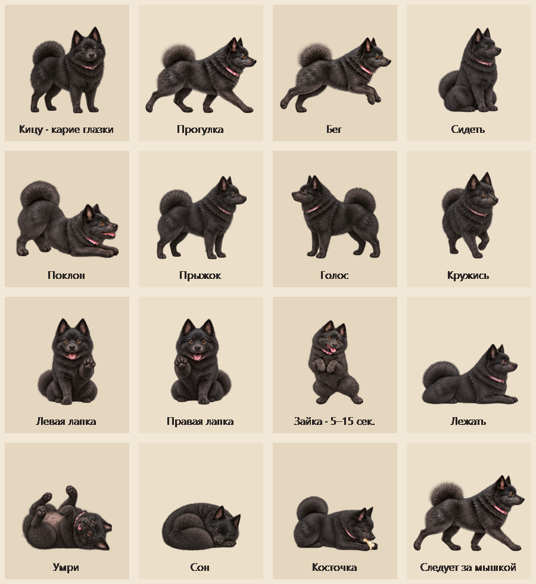

# Kitsu · desktop Schipperke

[Русская инструкция](README.ru.md)

Kitsu is an attentive, playful female Schipperke who lives on your Windows desktop. She has fluffy black fur, brown eyes and a pink collar, with 288 illustrated poses and genuine transparent edges.



## Download and run

**[Download Kitsu v4 for Windows x64](https://github.com/kales380-ctrl/Kitsu/raw/refs/heads/main/downloads/Kitsu-v4-windows-x64.zip)**

Extract the ZIP and open **Кицу.exe**. No installer or Internet connection is needed. The executable includes every animation image. Requires 64-bit Windows and .NET Framework 4.x. The current menus are in Russian.

The archive's SHA-256 checksum is in [downloads/SHA256SUMS.txt](downloads/SHA256SUMS.txt).

## Play with Kitsu

- Click her once to pet her: she closes her eyes and lifts her muzzle.
- Double-click to throw a ball.
- Drag her to another spot, or drag and release a toy to throw it.
- Right-click Kitsu or her tray icon for commands, toys and settings.

She walks, runs, sniffs, sleeps, jumps and chases her tail. Commands include bow, jump, bark, spin, give a random front paw, sit pretty, sit, lie down and play dead. Sit pretty holds for 5–15 seconds; sitting and lying continue until another command. Intermediate frames show her lowering, lifting and rolling her body rather than rotating a flat picture.

Give her a ball, bone or her favourite little rubber boar. She picks toys up in her mouth, carries them, shakes her head with them in her teeth, rolls them with her front paws, tosses them and lies down to chew. Games alternate activities for about three minutes. The toy stays on the desktop afterwards and can be thrown again.

The menu includes following the mouse, pause, sound, size, monitor selection and always-on-top. Close Kitsu through her menu or tray icon.

## Desktop icons

Occasional icon play is enabled initially and can be disabled in the menu. Kitsu may briefly move a desktop icon when the desktop is foreground. Returning it to its original position is enabled by default.

This feature changes only Explorer's desktop icon positions. It does not open, launch, rename, delete or alter the represented files. It skips automatically arranged icons and stops if you move the selected icon yourself. No Explorer settings are changed.

The app does not use the network or microphone. It does not configure automatic startup. Settings last until the app closes.

## Build from source

Open Windows PowerShell in the repository folder:

```powershell
.\build.ps1
```

The script uses the .NET Framework C# compiler bundled with Windows and writes Кицу.exe. No package restore is required. It embeds all 18 sprite atlases.

## Verification and animation sheets

```powershell
.\qa\run-tests.ps1
```

Checks cover animation phases, transparent sprites, toy physics on monitors with negative coordinates, nine game states for each toy, interrupted play, consistent toy identity, laying down and getting up, single timed release during tossing and cleanup. The transparent pet window was also smoke-tested on Windows.

See [command and toy storyboards](docs/kitsu-commands-v4.png), [walking, running and turning sequences](docs/kitsu-sequences.png), and [asset names and exact generation prompts](assets/animations.md). Artwork was made with built-in imagegen; the character and toy details are stored in transparent PNG atlases.

## Project layout

- src/ — Windows Forms behavior, per-pixel windows, sprite rendering and desktop icon adapter.
- assets/ — original sprite atlases and generation prompts.
- qa/ — behavior checks and visual diagnostics.
- docs/ — illustrated animation previews.
- downloads/ — portable Windows package and checksum.

Report bugs and ideas through this repository's Issues.
