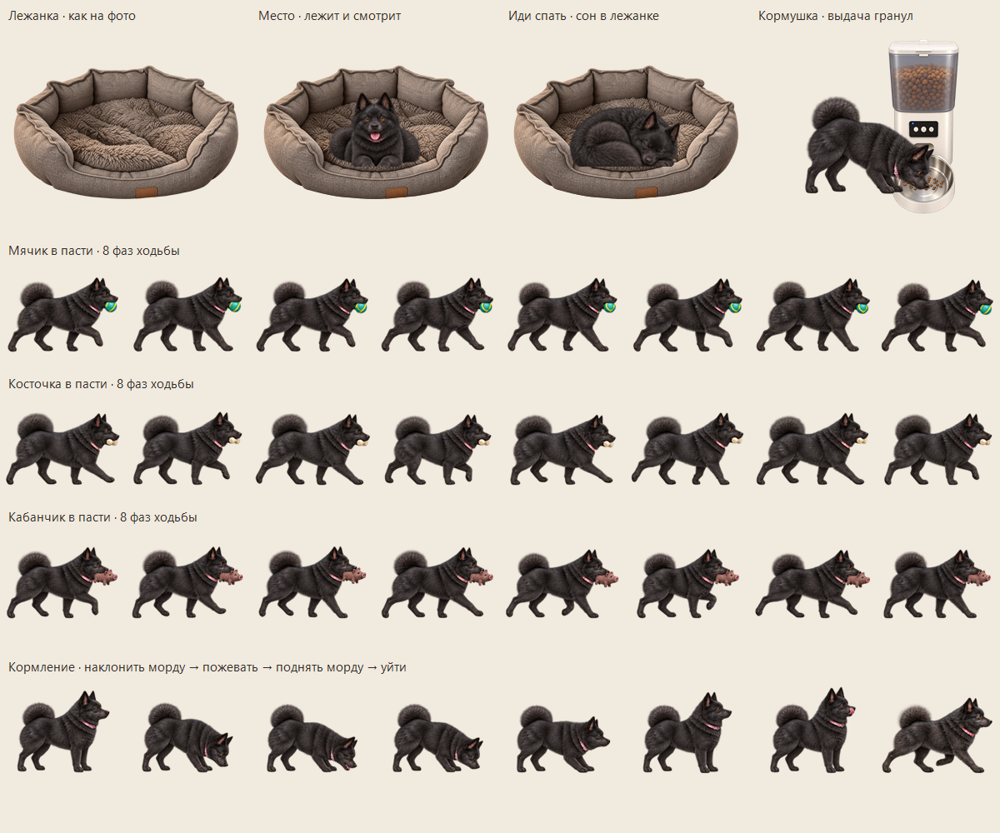

# Kitsu · desktop Schipperke · v7.0.0

Version 7 adds macOS builds for Apple Silicon and Intel alongside Windows. It also adds 48 illustrated lying-down and standing-up poses with the ball, bone and boar securely gripped between the jaws throughout the motion.

Version 6.0.1 fixes desktop window layering: Kitsu rests inside the bed and eats in front of the feeder, including after dragging furniture or switching always-on-top.

[Русская инструкция](README.ru.md)

Kitsu is an attentive, playful female Schipperke who lives on your Windows or macOS desktop. She has fluffy black fur, brown eyes and a pink collar, with 400 illustrated poses and genuine transparent edges.


## Download and run

**[Download Kitsu for Windows x64](https://github.com/kales380-ctrl/Kitsu/releases/latest/download/Kitsu-windows-x64.zip)**

Extract the ZIP and open **Kitsu.exe** on Windows 10/11 x64. The Windows version runs on .NET 10 and includes the runtime and every animation image in a self-contained executable. You do not need to install .NET or the SDK to run the downloaded package. No installer or Internet connection is needed after downloading. The current menus are in Russian.

Download [macOS for Apple Silicon](https://github.com/kales380-ctrl/Kitsu/releases/latest/download/Kitsu-macos-arm64.zip) or [macOS for Intel](https://github.com/kales380-ctrl/Kitsu/releases/latest/download/Kitsu-macos-x64.zip). Requires macOS 14 or later. Extract the ZIP, move **Kitsu.app** to Applications and open it. The .NET 10 runtime and all artwork are included. The app has an ad-hoc signature, without Apple notarization. If macOS blocks the first launch, use the app-specific **System Settings → Privacy & Security → Open Anyway** option described in [Apple’s instructions](https://support.apple.com/en-us/102445).

The SHA-256 checksums are attached to the [release](https://github.com/kales380-ctrl/Kitsu/releases/latest). macOS supports the dog commands, toys, bed and timed feeder; Explorer icon play is available on Windows only.

If Kitsu cannot start or encounters an error, it displays a message and writes details to `%LocalAppData%\Kitsu\kitsu-error.txt`. Paste that path into Explorer's address bar to open the log. If the location is unavailable, it falls back to `%TEMP%\Kitsu\kitsu-error.txt`. Include the error details when reporting an issue.

## Play with Kitsu

- Click her once to pet her: she closes her eyes and lifts her muzzle.
- Double-click to throw a ball.
- Drag her to another spot, or drag and release a toy to throw it.
- Right-click Kitsu or her tray icon for commands, toys and settings.

She walks, runs, sniffs, sleeps, jumps and chases her tail. Commands include bow, jump, bark, spin, give a random front paw, sit pretty, sit, lie down and play dead. Sit pretty holds for 5–15 seconds; sitting and lying continue until another command. Intermediate frames show her lowering, lifting and rolling her body rather than rotating a flat picture.

Give her a ball, bone or her favourite little rubber boar. She picks toys up in her mouth, carries them, shakes her head with them in her teeth, rolls them with her front paws, tosses them and lies down to chew. Games alternate activities for about three minutes. The ball, bone and boar stay on the desktop together. Selecting a different kind leaves the previous toy in place; selecting the same kind reuses it. Drag and release any toy to call Kitsu back to it. Choose «Убрать все игрушки» to remove them all.

The menu includes following the mouse, pause, sound, size, monitor selection and always-on-top. Close Kitsu through her menu or tray icon.

## Bed and feeder



Feeding poses keep all front paws outside the bowl while the lowered muzzle reaches the food. Near a screen edge, Kitsu approaches from the side with room for her body.

Kitsu has a grey fabric bed with a plush cushion, and a food dispenser with a reservoir, portion outlet and metal bowl. Drag either object to move it; their positions are remembered. Clicking the bed sends Kitsu to rest there. **Place / Место** makes her approach and lie awake facing you. **Go to sleep / Иди спать** always sends her to sleep in the bed. Her spontaneous naps choose randomly between the bed and the desktop.

Click the feeder, or choose **Покормить Кицу**, to dispense a portion and call Kitsu. Pellets fall from the outlet into the bowl. She approaches, lowers her muzzle, chews, lifts her head and walks away; the portion gradually disappears. Repeated clicks during that meal do not dispense another portion.

Automatic meals use the computer's local time at **10:00, 17:00 and 22:00** while Kitsu is running. A pause, open menu or dragging delays the action until it can begin; clock changes and resuming Windows are checked independently of animation time. The daily history prevents repeated portions after a restart or moving the clock backwards. Starting the app later does not replay meals missed before it was opened. Manual feeding is independent of this schedule. Scheduled meals can interrupt rest or play.

All three toys now have eight pickup poses and eight walking poses with the object drawn between the parted jaws. The mouth and toy belong to the same sprite, with lips occluding the grip; a toy is no longer drawn on top of the walking dog's closed muzzle.

## Desktop icons

On Windows, occasional icon play is enabled initially and can be disabled in the menu. Kitsu may briefly move a desktop icon when the desktop is foreground. Returning it to its original position is enabled by default.

This feature changes only Explorer's desktop icon positions. It does not open, launch, rename, delete or alter the represented files. It skips automatically arranged icons and stops if you move the selected icon yourself. No Explorer settings are changed.

The app does not use the network or microphone. It does not configure automatic startup. Bed and feeder positions and scheduled meal history are saved under `%LocalAppData%\Kitsu`. Other settings last until the app closes.

## Build from source

Install the [Windows .NET 10 SDK](https://dotnet.microsoft.com/en-us/download/dotnet/10.0), then open Windows PowerShell in the repository folder. The SDK is required only for building source and running development checks.

```powershell
.\build.ps1
```

The script publishes `artifacts\win-x64\Kitsu.exe` from `Kitsu.csproj`, targeting `net10.0-windows`. The first build restores .NET packages and needs Internet access. It embeds 27 artwork resources (25 dog atlases, the bed and the feeder) and the .NET runtime using [Microsoft's self-contained single-file deployment](https://learn.microsoft.com/en-us/dotnet/core/deploying/single-file/overview). The published executable runs without a separately installed runtime or SDK.

On a Mac with the .NET 10 SDK installed:

```bash
bash macOS/build-macos.sh osx-arm64
# Intel Mac:
bash macOS/build-macos.sh osx-x64
```

## Verification and animation sheets

```powershell
.\qa\run-tests.ps1
```

The checks use .NET 10 and write separate test builds under `artifacts\tests`, without overwriting the portable app. They cover animation phases, transparent sprites, toy physics on monitors with negative coordinates, nine game states for each toy, interrupted play, consistent toy identity, laying down and getting up, single timed release during tossing and cleanup. See [qa/README.md](qa/README.md) for the additional window and visual checks.

`Kitsu.exe --smoke-test` displays the transparent pet window for three seconds with icon play disabled. It writes `smoke-test.txt` beside the executable, or under `%LocalAppData%\Kitsu` when the application folder is read-only. Command-line failures return exit code 1 and log the error without opening a dialog.

See [command and toy storyboards](docs/kitsu-commands-v4.png), [walking, running and turning sequences](docs/kitsu-sequences.png), and [asset names and exact generation prompts](assets/animations.md). See the [v6 artwork and generation prompts](assets/generation-v6.md). Artwork was made with built-in imagegen; the character and toy details are stored in transparent PNG atlases.

## Project layout

- macOS/ — .NET 10 Avalonia frontend, Skia rendering and Mac app bundle packaging.
- .github/workflows/release.yml — native Windows and macOS builds, checks and release assets.
- src/ — Windows Forms behavior, per-pixel windows, sprite rendering and desktop icon adapter.
- assets/ — original sprite atlases and generation prompts.
- Kitsu.csproj / build.ps1 — .NET 10 project and self-contained publishing script.
- qa/ — behavior checks and visual diagnostics.
- docs/ — illustrated animation previews.
- downloads/ — links to the release packages and checksums.

Report bugs and ideas through this repository's Issues.
